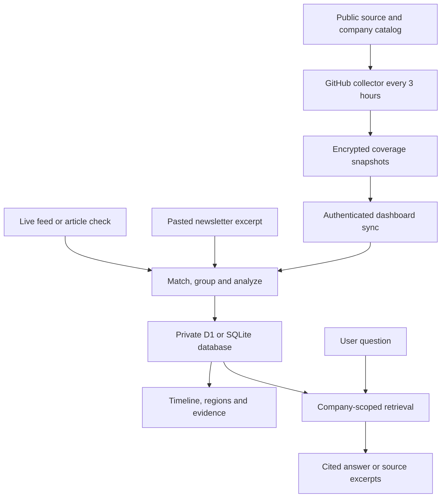
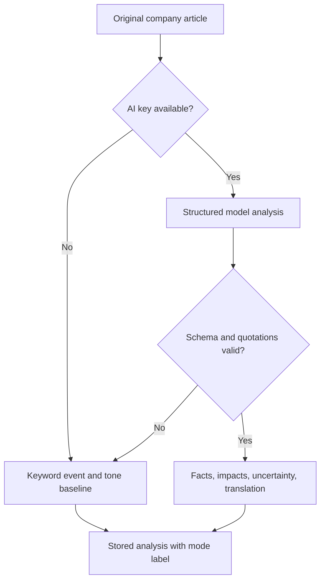
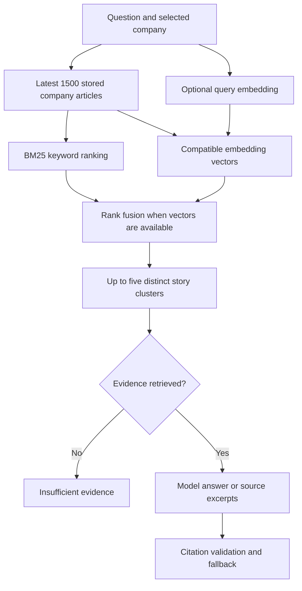

# Company Lens: complete architecture and AI pipeline

Company Lens is a private company-news intelligence application. It collects articles mentioning selected companies, keeps their provenance, groups related reports, produces cautious event analysis and answers questions from collected evidence. It currently seeds **139 Indian sources, 22 global sources and 20 companies**, including Vee Technologies. English, Tamil, Hindi, Kannada, Telugu, Malayalam, Bengali and Gujarati occur in the source catalog.

There are two distinct analysis modes. **The deployed application works without an AI key**, using keyword analysis and evidence search. The implemented model path provides contextual analysis, translation, embeddings and generated answers when a server-side key is configured. Adding sources or supporting a script does not itself enable reliable multilingual sentiment or cross-language search.

## 1. The complete system

The same TypeScript domain code is shared across the web application, scheduled runner, standalone server, tests and evaluation. This keeps matching and evidence handling consistent rather than implementing different intelligence rules in separate services.

## 2. Technologies and why they are used

| Component | Technology | Purpose and reason |
|---|---|---|
| User interface | React 19 + TypeScript | Interactive company selection, filters, evidence drawers and collection progress; typed contracts reduce mismatches between API and UI. |
| App framework | Vinext + Vite | Builds the existing React app and Worker-compatible server bundle, using one application for rendering and APIs. |
| UI primitives | shadcn components, Base UI, Lucide, CSS | Reusable dialogs, selects, switches, sidebars and tables with keyboard behavior; custom CSS preserves a consistent dashboard layout. |
| Hosted backend | Cloudflare Worker via Sites | Runs authenticated APIs and serves the privately hosted application without a separately managed web server. |
| Hosted storage | Cloudflare D1 | Durable relational storage, uniqueness constraints and indexed company queries. |
| Local storage | Node 24 native SQLite | Runs the same database contract locally without installing a separate database service. |
| Schema | Drizzle ORM schema and generated migrations | A versioned source of truth for table structure; applied migrations are immutable. Runtime queries use prepared, bound statements. |
| Input validation | Zod | Validates API bodies, AI output, encrypted snapshot contents and manifests before use. |
| RSS parsing | fast-xml-parser | Handles RSS and Atom structures; entity declarations are rejected before parsing. |
| Scheduling | GitHub Actions cron; Node interval for standalone | Checks sources without a browser tab. GitHub suits this public portfolio repository; the standalone scheduler handles custom workspace sources too. |
| Snapshot privacy | Web Crypto RSA-OAEP/SHA-256 + AES-256-GCM | Encrypts collected text before GitHub storage. Only the private app receives the decryption key. |
| Compression | gzip via CompressionStream | Reduces encrypted transfer/storage size; compression occurs before encryption. |
| Baseline NLP | Unicode matching, keyword rules, BM25 | Transparent, inexpensive behavior that works without paid AI services. |
| Optional language model | OpenAI Chat Completions, default `gpt-4o-mini` | Produces schema-constrained event analysis, English translations and evidence-grounded answers. The model name is configurable. |
| Optional embeddings | OpenAI embeddings, default `text-embedding-3-small` | Represents semantic similarity beyond literal keyword overlap; vectors are stored with their model ID. |
| Retrieval combination | Cosine similarity + reciprocal rank fusion | Combines semantic matches with exact keyword matches without comparing incompatible raw scores. |
| Verification | Node test runner, TypeScript checking, GitHub CI | Exercises persistence, access rules, source parsing, encrypted sync, scheduling, fallbacks and built runtime behavior. |

The document extension adds PDF.js text extraction and opt-in vision-model OCR, with private R2 originals and human review before OCR text enters intelligence. See [the cloud and document pipeline](cloud-pipeline.md) for its full architecture. There is no LangChain dependency, separate vector database, locally trained GPU model, learned entity linker or neural reranker.

## 3. Discovery and source collection

### Source catalog

`lib/source-catalog.json` records each feed's URL, region, language, publisher and reference. Multiple feeds from one publication are counted as feeds, not independent publishers. State/area labels describe source coverage; they do not geolocate every event in an article. See [catalog definitions and provenance](source-catalog.md).

The GitHub collector checks all 161 built-in sources against the 20 built-in companies. It uses at most four concurrent collection tasks and serializes requests to the same hostname. A source failure is recorded while other sources continue. Transient transport and selected server errors receive one retry; access denials are not retried.

The standalone collector processes every enabled source due after three hours, with at most three concurrent tasks and the same-host serialization. An always-running process is required. Manual checks also work through the private app. Public article pages and user-pasted newsletter excerpts enter through a separate import endpoint.

### Retrieval boundaries

The source fetcher permits public HTTPS DNS names, rejects credentials/custom ports/local addresses, checks public DNS responses, revalidates redirect destinations, consults robots rules, limits redirects, and bounds response time and size. These are defense layers, not a universal proof against DNS rebinding on every possible self-hosted network. Publisher blocks and subscription requirements are respected.

RSS/Atom bodies are parsed into title, URL, text, publication date and language. HTML imports prefer `article` or `main` content, then paragraphs; script/navigation markup is removed. Unknown publication dates stay null. Collection time is recorded separately, so fetching an old article does not make it new reporting.

Scheduled snapshots retain a maximum of 2,000 matching company/article records, with text capped at 2,400 characters each. Overflow is labelled. Live imports allow up to 14,000 characters. RSS content remains labelled `feed-excerpt` even if a feed supplies a full article. The system cannot retrieve everything ever published about a company or guarantee that feed windows contain all intervening reporting.

## 4. Company matching and multilingual handling

The company name and curated aliases are normalized using Unicode NFKC, lowercase and whitespace normalization. Unicode-aware boundaries prevent an acronym such as `TCS` from matching inside an unrelated longer word. The same item can create a separate record for each company it mentions.

Explicit aliases are easy to inspect and improve. This is why they are used for the first version: a recruiter can see exactly why a document entered a company timeline. The tradeoff is recall. Unlisted regional spellings, abbreviations, subsidiaries and ambiguous company names can be missed or misidentified. `Vee` alone is deliberately not an alias for Vee Technologies.

Script heuristics identify Tamil, Kannada, Telugu, Malayalam, Gujarati, Gurmukhi/Punjabi, Odia, Bengali/Assamese and Devanagari. For shared scripts, supplied source language helps preserve Marathi or Assamese. Script detection is not a trained language classifier.

The original text is always preserved. In model mode, the model can generate an English title and text translation, while evidence quotations remain in the original language. This lets users inspect the source behind the interpretation. Live translation quality and cross-language retrieval have not been independently benchmarked for the added languages. Without model enrichment, search is primarily lexical and tone rules are largely English with a small Tamil vocabulary; unsupported phrasing often remains `unclear`.

## 5. Deduplication and story grouping

Two operations solve different problems:

1. **Exact article identity:** canonical URLs remove common tracking parameters. A unique `(company_id, url)` constraint makes repeated imports idempotent.
2. **Related-story grouping:** a normalized text SHA-256 fingerprint identifies exact text repeats. Otherwise, token-set Jaccard similarity groups a report if title similarity is at least 0.72 and body similarity at least 0.45, within three days and the same company.

Grouping reduces repeated stories in the timeline and RAG context. It is a heuristic, not independent corroboration or learned cross-language event clustering. Only a bounded recent company corpus is compared, so very old repeats may not be recognized as the same cluster.

## 6. Analysis: from an article to an event

The baseline extracts an original sentence, assigns a topic from explicit keyword rules, and labels tone positive, negative, mixed or unclear. Some negated negative phrases are handled. It does not invent stakeholder implications. Its purpose is a transparent fallback, not a high-accuracy multilingual sentiment classifier.

With a configured key, `lib/provider.ts` requests strict JSON containing event type, tone, summary, one to five reported facts and original quotations, up to four stakeholder impacts, uncertainty and optional English translations. Employees, customers, local communities and the business can be affected differently; a single company-wide “good/bad” score would obscure that distinction.

Zod checks output shape and lengths. Every quoted passage must occur in the normalized original title/text. Invalid, refused, incomplete or unavailable model output produces a labelled fallback. Source text is explicitly marked untrusted in the model instructions. Quotation checks establish provenance, not that the news report is true or that every generated claim follows logically from it.

The scheduled collector does **not** make paid model calls. Synced articles receive baseline analysis. With a server AI key, the **Enrich** action processes up to three stored articles per request. Live collection with a key can also analyze new articles. Model analysis reads at most 9,000 source characters; embeddings use at most 6,000 input characters. This limits cost and request size, but can omit details later in a long import.

## 7. RAG: answering questions from evidence

RAG means retrieval-augmented generation: find relevant stored evidence first, then ask a model to answer from that evidence.

**BM25** rewards relevant query words and reduces the dominance of long documents or terms common throughout the corpus. It is especially useful for company names, product names, abbreviations and exact events. The implementation uses `k1=1.5`, `b=0.75`, precomputes term/document frequencies for a query, and ranks original text plus any stored translations.

**Dense retrieval** compares a question embedding with stored article embeddings by cosine similarity. This can find semantically related wording with fewer identical words. Only vectors from the currently configured embedding model participate. A provisional similarity cutoff of 0.28 is used; it is not a calibrated confidence score.

**Reciprocal rank fusion** combines the BM25 and dense result lists using the sum of `1 / (60 + rank)`. Rankings rather than raw scores are combined because BM25 scores and cosine scores have different scales. One representative per related-story cluster is selected, up to five documents, so repeated announcements are less likely to fill the whole context.

**Generation** receives the selected original passages, title, publication date and content scope. Each supplied document receives a citation identifier. The model is instructed to use only that evidence, mark uncertainty and preserve allegations as allegations. Citation markers and declared IDs are checked against the supplied sources. An answer that fails validation is replaced by supporting excerpts.

**Abstention:** no retrieved evidence produces an insufficient-evidence response. If the model is unavailable, users receive labelled source excerpts. Neither retrieval scores nor citation existence alone prove factual correctness; answer entailment still needs human evaluation.

The retrieval unit is currently one bounded article/excerpt, or one imported PDF page. There is no separate overlapping-chunk index. Vectors are stored as JSON in the relational database and scored in memory across at most 1,500 articles for the selected company. Stored text is capped at 14,000 characters per record; model analysis receives the first 9,000, embedding input the first 6,000, and answer generation the first 4,000 per selected record. Later passages can therefore be omitted from model context. Larger archives and long documents would benefit from passage chunking, a dedicated vector index, incremental BM25 and benchmarked reranking.

## 8. Scheduling, encryption and private synchronization

The workflow uses `17 */3 * * *` in UTC: one intended run every three hours. GitHub can delay starts and can disable inactive scheduled workflows. The schedule is not a guaranteed delivery SLA.

Every run creates a fresh AES-256-GCM data key, compresses the snapshot, encrypts it, and wraps that data key with the application's RSA-OAEP public key. The public key can be committed safely; the private key stays in the hosted server's secret configuration. GitHub does not need an AI key, private application password or access to the private database. Encryption protects confidentiality; trust in the snapshot publisher additionally relies on the controlled GitHub branch and HTTPS, not encryption alone.

The collector writes ciphertext to a separate `coverage-data` branch, leaving source `main` unchanged. A manifest records snapshot IDs, timestamps and SHA-256 hashes. The branch exposes an active sync window of 56 snapshots, approximately seven days. Earlier ciphertext may remain in Git history; removing it from the manifest is not secure deletion.

When the authenticated dashboard opens, it downloads and verifies a snapshot, decrypts it server-side, validates its schema and imports at most 40 items per request. A persistent cursor and company/URL uniqueness let interrupted syncs resume. A database lease prevents overlapping sync work. Source switches and current company aliases are respected before insertion. Private custom companies, pasted newsletters, questions, keys and source definitions are never uploaded to the scheduled repository by this flow.

Collection continues with the browser closed. A configured ChatGPT automation calls the scoped private maintenance API every three hours to import snapshots into D1, process historical/document jobs and perform opted-in model enrichment. Browser sync remains a manual fallback. The dashboard shows the actual maintenance heartbeat. Seven days of encrypted snapshots are retained; an outage beyond that window can miss expired runs. Custom publisher sources are checked by maintenance; arbitrary custom companies require live collection or the standalone collector. Edit the public catalog to change what the GitHub runner monitors.

## 9. Database and access design

| Table | Stored data | Why it exists |
|---|---|---|
| `companies` | Official domain, name, aliases, industry, notes | Defines the matching scope and company identity. |
| `sources` | Feed/page URL, region, language, enabled state, fetch status | Gives users control and makes source failures visible. |
| `articles` | Company link, original text, dates, source, analysis, cluster, optional vector | Keeps provenance and intelligence together. |
| `runs` | Scanned, matched, inserted, duplicate and error counts | Makes collection auditable and debuggable. |
| `settings` | Catalog version, sync cursor, preferences and schedule status | Resumes upgrades and synchronization safely. |
| `leases` | Expiring source/cycle/sync locks | Prevents duplicate concurrent work and recovers from interrupted jobs. |

The API is a custom Worker router. Private Sites identity is accepted only when the deployment explicitly trusts its authentication gateway. Scoped maintenance routes also accept an exact server-configured service secret after the private Sites gateway. Standalone mode disables forwarded-identity trust and requires a dashboard password outside loopback. Browser writes are checked for same-origin; most use validated JSON, and PDF uploads use bounded multipart bodies. Keys never appear in client API responses.

Current workspace limits are 75 companies and 250 configured sources. Dashboard, RAG and export read the latest 1,500 stored articles per company; coverage diagnostics count every stored record. Recent activity shows 150 runs. Production D1 data and local SQLite data are separate stores, not automatic mirrors. PDFs are limited to 4 MB and 20 pages per upload.

## 10. Verification and portfolio claims

Tests cover alias boundaries, dates, RSS/Atom handling, unsafe input/redirect rejection, idempotence, company isolation, quotes, fallbacks, catalog upgrades preserving edits, scheduling at three hours, same-host serialization, encryption round trips, tamper rejection, resumable sync and built standalone behavior.

The retrieval fixture has 18 hand-authored questions over eight fictional articles in seven story groups. It measures Recall@5, MRR and abstention on that fixture. Its Tamil translation is prewritten. It does not establish real-world retrieval accuracy, multilingual quality, source reliability or LLM factuality. See [evaluation](evaluation.md).

An accurate portfolio description is: **“Built a multilingual company-news intelligence system with scheduled cloud ingestion, resumable historical imports, PDF extraction, reviewable vision OCR, provenance validation and hybrid retrieval.”** The system integrates pretrained models; it does not train an ML model, offer verified reputation scores or have measured accuracy for every supported language. Paid OCR and model integration still require validation with a working user key.

## Technology source discovery

The expanded catalog has 141 RSS/Atom endpoints and 20 discovery entries. For a discovery entry, `lib/sources.ts` reads only the public publisher page to find advertised feed links (`link` RSS/Atom MIME types or RSS/XML anchors). It excludes comments and script content, validates each destination as public HTTPS, checks its robots policy, and tries at most three candidates. No advertised or readable feed produces a visible source error and a manual-import path. There is no private API integration with Dailyhunt, Way2News or Lokal.

Regional feeds are larger because UTF-8 Indian scripts require multiple bytes per character and some publishers embed long descriptions. Feed retrieval is bounded at 4 MB; pages remain at 1.5 MB, and parsing still keeps only 150 entries. Oversized data is rejected, not silently treated as a successful partial feed. Checks preserve the distinction between a readable feed, matching company coverage and reliable analysis.
