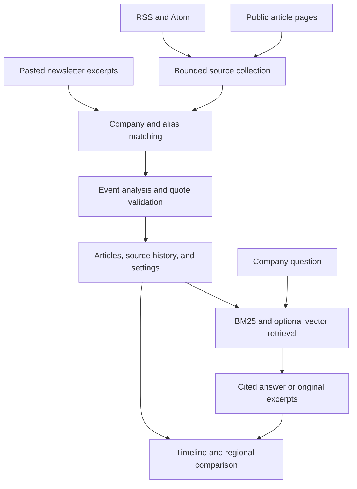

# Architecture and design decisions

Company Lens is a single-user company intelligence workspace. It uses one application and one schema across Cloudflare D1 and a native SQLite standalone runtime.

## Collection

- Eight starter feeds cover Indian English reporting, Tamil reporting and global business/technology. Five initial company watchlist entries are configurable. Neither a feed entry nor a named company is treated as a verified corporate fact.
- Feeds are parsed as RSS/Atom with `fast-xml-parser`; custom XML document types/entities are rejected before parsing. RSS bodies are marked `feed-excerpt` even if a publisher happens to supply full text.
- Public HTML extraction prefers `article` or `main`, then paragraphs. Script/navigation blocks are stripped. JavaScript-rendered/paywalled pages are not unlocked; users may paste an excerpt they are entitled to use.
- URLs must be public HTTPS DNS names with no embedded credentials or custom port. Every redirect is validated, host addresses are checked via DNS-over-HTTPS, response sizes and timeouts are bounded, and robots rules are consulted. Cloudflare/hosting network isolation is an additional boundary; DNS preflight is not a general guarantee against every form of DNS rebinding on arbitrary infrastructure.
- Original title, text, language, URL, publication date, collection date and content scope remain separately stored. Unknown publication dates remain unknown. Future dates beyond a one-day clock tolerance are rejected.
- A feed item can create a separate record for each matching company. A company/URL unique index makes repeated collection idempotent. A bounded run inserts at most eight new company/article records. Remaining feed items are considered on later runs.
- Source leases prevent overlapping collections. A failed run records its source error and partial progress; stored articles remain available. Model failures keep usable, labelled baseline analysis.

## Identity and duplicate handling

Company matching uses explicit names and user-managed aliases with Unicode-aware boundaries. It supports Tamil spellings without treating an embedded acronym as a match. It does not implement a learned entity linker, automatically discover subsidiaries, or perfectly disambiguate common names. Add specific names and regional aliases; avoid ambiguous abbreviations.

Canonical URLs remove tracking parameters. Separate reports may share a cluster if their content hashes match, or their title/body similarity is high within three days. Clusters are company scoped. This is a conservative heuristic, not a learned cross-language event model, and it cannot prove that two outlets share the same original source. The UI never labels source count as independent confirmation.

## Analysis and retrieval

Without a key, the app uses a conservative keyword baseline. It preserves original passages and marks ambiguous or negated cases unclear. It does not infer stakeholder impacts or translate live text.

With `OPENAI_API_KEY`, a strict structured-output request extracts event type, development tone, a summary, quoted evidence, conditional stakeholder implications, uncertainty and optional English translations. Zod validates limits, and every fact quotation must occur in the original text. Invalid model output falls back to baseline with a recorded warning. Quote containment establishes provenance, not truth or semantic entailment of every generated sentence.

Embeddings use a configured model and are stored with its identifier. Query retrieval combines BM25 and cosine-ranked compatible vectors through reciprocal rank fusion. Query-time retrieval falls back to lexical search if the embedding service fails. A provisional cosine cutoff is used; it has not been calibrated on an independent news benchmark. One representative per related-story cluster reaches the context, up to five documents.

The answer request is grounded only in selected original passages. Citation identifiers are validated against that context. If no passage is retrieved, the system abstains. If answer generation or citation validation fails, the original excerpts are returned with a visible fallback notice. This is not a guarantee that all model-generated claims are entailed; human evaluation remains necessary.

## Storage and deployment

`db/schema.ts` defines companies, sources, articles, collection runs, settings and leases. Generated Drizzle migrations are the schema authority. Application queries use bound parameters. Relevant unique and compound indexes cover company/URL, company/date and content fingerprints.

The Worker entrypoint intercepts API routes and delegates browser rendering to Vinext. Private Sites use the platform access gate and explicitly trusted forwarded identity. Standalone hosting forces that trust flag off and uses a configured dashboard password when accessible beyond loopback. Private preview data is single-owner data; this is not a multi-tenant SaaS.

`scripts/server.mjs` runs the built Worker on Node 24, serves built assets, and maps the D1 query contract to native SQLite. It applies checked-in migrations once, rejects changes to previously applied migrations, enables foreign keys/WAL, and keeps its database outside source control.

## Scheduling

All scheduler paths call the same `scheduledTick` function. One enabled source not checked in 24 hours is selected per tick; D1/SQLite leases prevent overlapping work.

| Runtime | Trigger | While browser is closed? |
|---|---|---|
| Standalone Node/Docker | Startup and every five minutes when `SCHEDULE_ENABLED=true` | Yes, while the process stays running |
| Private Sites preview | Optional browser polling every five minutes | No |
| Standalone Worker | Configured hourly Cron Trigger | Yes |
| GitHub Actions | Optional hourly authenticated POST to a standalone endpoint | Yes |

The private Sites gateway is browser authenticated; the GitHub scheduler cannot call that private URL. Do not enable multiple scheduler mechanisms unnecessarily. Collection is bounded to what feeds still expose when checked; it is not an exhaustive archive.

## Current limits

- 25 companies, 20 source definitions and the latest 300 articles per company in dashboard/retrieval/export.
- English, Tamil and Hindi source metadata; lightweight script detection for Tamil/Hindi. Translation quality is unbenchmarked.
- No email inbox integration, subscription bypass, OCR, learned sentiment classifier, entity-linking model, neural reranker, or cross-language event clustering.
- No independent publisher reliability score, verified corporate reputation score, or investment recommendation.
- No automatic external messaging. Digests are downloaded inside the app.

These limits keep the first version inspectable and make future portfolio improvements measurable.
