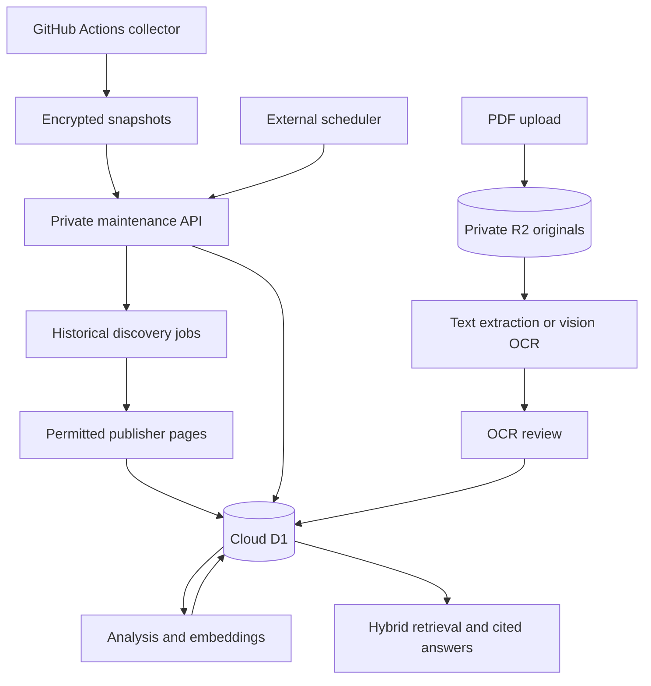

# Cloud collection, historical imports and document intelligence

Company Lens stores articles, companies, source health, collection runs, resumable jobs and settings in the private Site's Cloudflare D1 database. Uploaded original PDFs are stored in private Cloudflare R2; page text and processing metadata live in D1. Opening the dashboard is not required by the maintenance endpoint. An external scheduler must call it; exporting a Worker `scheduled` function alone does not register a schedule on Sites.

## Why public imports started in baseline mode

The public GitHub runner has the RSA public encryption key. It does not receive the private decryption key, the database binding or the user's OpenAI key. It gathers bounded public excerpts and encrypts them before committing snapshots to the coverage-data branch. The private Site decrypts and imports these. Baseline analysis makes ingestion usable without a paid API. Background enrichment is now a separate, opt-in private operation; the API key stays in the private environment/database.

## Data and processing

| Stage | Implementation | Purpose and limits |
|---|---|---|
| Discovery | 161 configured RSS/Atom and publisher feed-discovery entries; GDELT DOC historical search | Finds candidate reporting. A configured outlet is not a guarantee of successful access. Historical indexing is incomplete and capped at 250 results per company per seven-day window. |
| Safe retrieval | HTTPS URL validation, DNS checks, bounded responses, timeouts, redirect validation, robots policy | Stops unsafe network targets and records inaccessible publishers without bypassing access controls. |
| Extraction | fast-xml-parser for RSS/Atom; HTML article/main/paragraph extraction; publication metadata and JSON-LD | Retains original text, language, URL and separate publication/collection dates. HTML extraction is heuristic and cannot read every dynamic page. |
| Entity matching | Explicit company names and aliases with boundary-aware matching | Reduces abbreviation collisions. Alias coverage determines recall, including for regional scripts. This is not a trained NER model. |
| Deduplication | Canonical URLs, company/URL unique index, normalized content hash and conservative text similarity clusters | Prevents exact repeat imports and groups likely related reporting. Grouping does not establish independent corroboration. |
| Baseline classification | Conservative English/Tamil keyword rules | Provides a free fallback. It does not provide contextual multilingual understanding, translation or stakeholder inference. |
| Model analysis | OpenAI Chat Completions, configurable model (default gpt-4o-mini), JSON schema validation and source-quote checks | Adds contextual sentiment, event labels, translations, summaries and stakeholder impacts. Quotes must occur in stored text; that does not prove the publisher's report is true. |
| Embeddings | OpenAI text-embedding-3-small by default; vectors stored with model identifier | Supports semantic search across different wording and languages. Model calls need a valid funded key. |
| Retrieval | BM25 lexical ranking plus cosine vector similarity and reciprocal rank fusion | Combines exact company/event words with semantic relevance. The application searches up to 1,500 recent records per company; SQL coverage totals count all stored records. |
| Answering | Top relevant, deduplicated source passages; citation checks; insufficient-evidence response | Grounds answers in the collected sample. No-key mode returns source passages instead of synthesized claims. |
| PDF text | unpdf's PDF.js extraction, one page per job step | Extracts existing text layers without a paid model. Bound to 4 MB and 20 pages per upload. Unusual fonts/layouts can need review. |
| Scanned PDF OCR | pdf-lib isolates one page; OpenAI Responses receives the PDF page as a file input | Uses a vision model to transcribe the original language. It can make mistakes. OCR text is excluded from intelligence until the user approves the transcription. Original PDFs remain downloadable. |
| Job durability | D1 jobs table, saved cursors/counters, leases and duplicate-safe inserts | Survives closed pages and interrupted requests. Failed URLs, unknown dates, unrelated matches and capped searches remain visible. |

## Private AI setup

Open **Settings & methodology → Private AI connection**. Enter the key in the password field, choose automatic enrichment and a daily background attempt limit, then save. AES-256-GCM encrypts the key before D1 storage; the encryption key is a server secret. The browser receives configuration status and the last four characters only. A failed replacement preserves the previous key. Environment-provided keys take precedence.

Key validation checks access to the configured analysis model. It does not prove available credits or access to every embedding/vision endpoint. An attempt can include both analysis and embedding calls, or one OCR page. The background limit counts attempts, including failures; it is not a monetary budget. Questions and manual enrichment are separate usage. OCR is explicitly enabled per document and sends the page to OpenAI. No real paid-model call can be verified until a working user key is configured.

## Running without a browser

The public collector workflow requests execution every three hours; GitHub can delay scheduled jobs. Private imports and enrichment are driven by `POST /api/maintenance`. Each invocation performs a bounded, resumable unit and returns `pending`. The external scheduler should repeat while pending, with a bounded runtime, and resume remaining work next time. Maintenance honors the workspace sync pause, processes historical/document queues, checks due custom publishers and reserves the daily AI attempt allowance. Three failed enrichment attempts stop automatic retries for that article; manual enrichment remains available.

On the private Site, machine calls require both the native Sites gateway bearer in `OAI-Sites-Authorization` and the configured application secret in `X-Company-Lens-Service`. The gateway consumes its own header, so it cannot be the application's only authentication check. Service authentication is restricted to state, diagnostics, sync, maintenance and historical-import routes; it cannot change AI keys, companies or sources. Never put these values into the public repository or browser code.

Do not assume that a future job ran successfully. **Data & imports** shows the actual maintenance heartbeat, errors, pending work and database totals. A paused/disabled scheduler, expired/rotated credential, inaccessible publisher or missing model key is visible as an operational limitation.

## Historical coverage and empty states

HTTP 429 responses now preserve the current date window and set a shared retry time (at least 15 minutes, respecting a longer Retry-After up to 24 hours). No further index search is made during that cooldown. Already discovered publisher pages can still be processed. Earlier skipped HTTP 429 windows are recovered from each job's saved gap log and queued for another attempt. The maintenance response distinguishes deferred work from immediately runnable work so the scheduler does not repeatedly hit the rate limit. Search windows checked include failed attempts and are not a measure of complete news coverage.

Select a range within the last 90 days and monitored companies. Each company receives its own job. Discovery timestamps are never substituted for publication dates: accessible publisher metadata must establish a date inside the requested interval. Unknown dates, outside-range pages, inaccessible pages and unmatched company aliases are counted separately. Partial jobs can recheck their date range; existing article URLs remain unique. The URL import API can append independently discovered links from enabled monitored publishers to an existing job for the same verification pipeline.

Collected counts describe the current encrypted snapshot's company-matched records. Imported counts are all article/company records stored in D1, not unique real-world events. Pending records refer to the current snapshot; additional pending snapshots may contain more. Failed-source counts are separate from failed historical URLs. A company with zero records has no verified matched article in this stored sample; it does not have a zero reputation score or prove an absence of news.

## Validation

Tests cover encryption/tamper rejection, failed-key replacement, authentication scope, historical date/domain/company checks, resumable cursors, explicit index-failure gaps, actual text-PDF parsing, scanned-PDF waiting state, input bounds, snapshot encryption and sync idempotency. Production deployment and real historical import outcomes must be recorded separately from local fixture tests.
